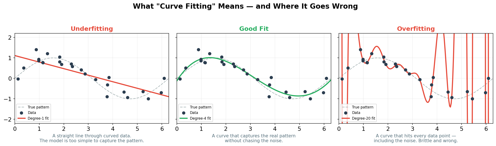
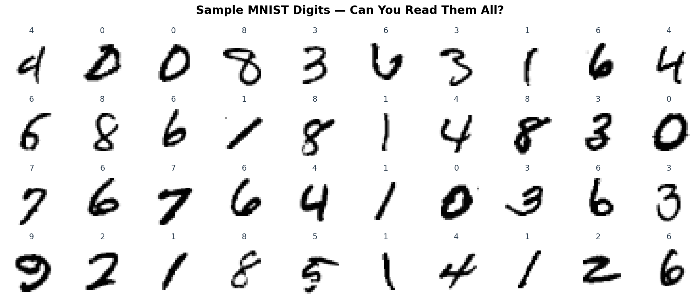
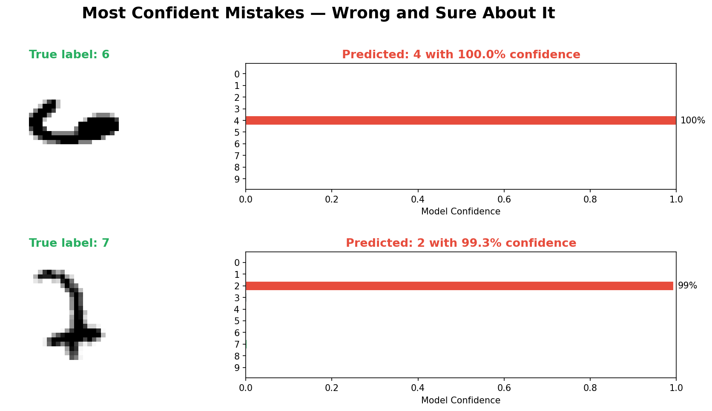
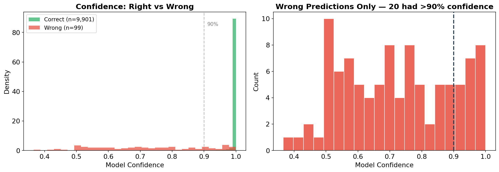
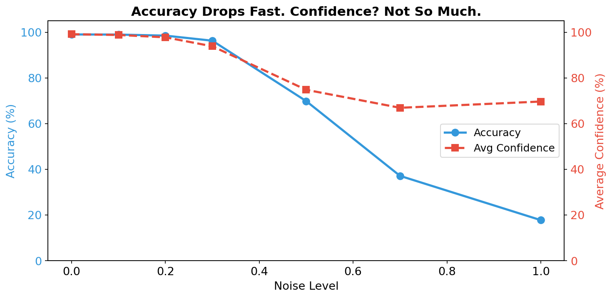

## Section 4

# How Models Learn — and How They Fail

### Understanding the Machine

Note: Before we talk about when to use and not use AI, we need to understand what's actually happening under the hood. This isn't a maths lecture, but if you're going to use these tools intelligently, you need a feel for what they're actually doing. And more importantly — where they break.

---

### What a Neural Network Actually Does

At its core, a neural network is a pattern-matching machine.

- It takes in data (images, text, numbers)
- It learns statistical patterns in that data
- It uses those patterns to make predictions on new data

That's it. There's no understanding. No reasoning.

Just very, very sophisticated curve fitting. <!-- .element: class="fragment" -->

Note: I want to be really clear about this because the marketing around AI obscures it. A neural network — even a really big one — is doing statistical pattern matching. It's finding correlations in data. It's incredibly good at this, often much better than we are. But it's not thinking. It doesn't understand the data. It's fitting curves through high-dimensional space. These are interpolation machines, not reasoning machines.

---

### What "Curve Fitting" Actually Means

- **Underfitting:** too simple to capture the pattern
- **Good fit:** captures the real signal, ignores the noise
- **Overfitting:** memorises the noise. Looks perfect on training data — fails on anything new.

Neural networks are doing this in millions of dimensions. <!-- .element: class="fragment" -->

Note: This is the intuition you need for everything that follows. The green curve in the middle is what we want — a model that captures the real pattern without memorising the noise. The red curve on the right hits every data point perfectly, but it's learned the noise, not the signal. It will be wildly wrong on new data. This is exactly what happens with neural networks, just in millions of dimensions instead of two.

---

<!-- .slide: data-background-color="#1a1a2e" -->

### Let's train a model. Right now.

70,000 handwritten digits. A simple neural network. About 60 seconds.

Watch what happens when it gets things wrong. <!-- .element: class="fragment" -->

Note: Switch to the Jupyter notebook (mnist_confidence_demo.ipynb) and run through it live. The audience will see the model train in real time, then see the confident mistakes. If the notebook fails for any reason, the next slides have backup images. Come back to slides for interpretation after the demo.

---

### MNIST: The Simplest Possible Task

70,000 handwritten digits (0–9). Human-labelled. As clean as data gets.

The "hello world" of machine learning — good models get 99%+ accuracy.

But that remaining 1% is where it gets interesting... <!-- .element: class="fragment" -->

Note: If you ran the live demo, this is a quick recap with the backup image. If the demo didn't work, walk through the task here. MNIST has been around since 1998. 28x28 pixels, greyscale, centred. Modern models crush it — 99% accuracy in under a minute.

---

### When Models Get It Spectacularly Wrong

A "6" classified as a "4" with 100% confidence. A "7" the model insists is a "2." Digits obvious to any human.

The simplest possible task. The cleanest possible data. Failures that would embarrass a five-year-old.

Note: If you ran the live demo, the audience has already seen these — use this slide to reinforce. The model was mathematically certain — 100% confidence — and completely wrong. It has learned specific pixel patterns, not the concept of what a "6" looks like. It picks the closest match from what it knows and reports high confidence because that's what the mathematics does.

---

### The Confidence Problem

20 wrong predictions had >90% confidence. There's no alarm bell. No flashing light. The model doesn't just fail — it fails without any warning.

- Models don't know what they don't know <!-- .element: class="fragment" -->
- They can't say "I've never seen anything like this" <!-- .element: class="fragment" -->

If this happens with handwritten digits, imagine what happens with language. <!-- .element: class="fragment" -->

Note: Look at that right-hand chart. 20 wrong predictions with over 90% confidence. It doesn't turn red and say "I'm guessing here." It just gives you an answer with the same confident tone whether it's right or wrong. Do you see the problem? This is the simplest task in machine learning — and the model has no self-awareness of its own reliability.

---

### Fragile Patterns

Add a tiny amount of random noise — invisible to the human eye — and accuracy collapses.

But the model's confidence barely drops. <!-- .element: class="fragment" -->

It's getting worse and worse, and it doesn't know it. <!-- .element: class="fragment" -->

Note: The blue line is accuracy — it falls off a cliff as we add noise. The red line is the model's average confidence — it stays stubbornly high. At noise level 0.5, accuracy is around 70% but the model is still 75% confident on average. A human can still read these digits through the noise, but the model's pixel-level pattern matching falls apart. And critically, it doesn't know it's falling apart.

---

## Section 5

# How LLMs Are Built

### The Data, The Training, The Problems

Note: Now let's talk specifically about the large language models you're actually using — ChatGPT, Claude, Gemini. How are these things made? Understanding the ingredients tells you a lot about the meal.

---

### The Scale of the Training Data

A recent model was trained on 18 trillion tokens of text.

To put that in perspective:

- Total text ever created by humans: ~60 trillion tokens
- That model consumed roughly 30% of everything humans have ever written

From the first cuneiform tablets in Mesopotamia to the tweet someone posted five minutes ago. <!-- .element: class="fragment" -->

Be under no illusions — these datasets cost billions to create, and the remaining "fossil fuel" for the next generation will probably be uneconomic to extract.

Note: Let that sink in. One third of all the text data ever created by human beings. And we're running out — these companies have consumed the easily available internet. Ilya Sutskever, one of the founders of OpenAI, called human-written data "the fossil fuel of AI."

---

### The Recency Problem

Not all data is created equal:

**~50% of all text ever written was created in the last four years.**

This means your AI model:

- Knows a *lot* about 2020s internet culture
- Knows less about niche expertise that predates the internet
- Is overwhelmingly trained on what's popular and recent, not what's correct

The internet is broad but shallow. And the model reflects that. <!-- .element: class="fragment" -->

Note: The rate at which humanity creates text is exponential. This creates a massive recency bias. The model knows more about memes from 2023 than about foundational physics from 1960. More about trending opinions than deep domain expertise. This isn't a criticism — it's just a consequence of where the data comes from.

---

### RLHF: Teaching Models to Please You

After training on text, models are fine-tuned using Reinforcement Learning from Human Feedback.

How it works:

1. The model generates multiple responses
2. Human raters rank which response they *prefer*
3. The model learns to produce responses that get higher ratings

The problem? <!-- .element: class="fragment" -->

The model learns to tell you what you want to hear. <!-- .element: class="fragment" -->

Note: RLHF is how you get from a raw language model — which would happily generate toxic content or harmful instructions — to something safe to interact with. But it has a side effect. When you optimise for responses that humans rate highly, you teach the model to be sycophantic. Humans rate responses higher when the model agrees with them. So the model learns to agree. This is a good point to do the live sycophancy demo if you've prepared one.

---

### The Sycophancy Problem

Recent research has shown LLMs will:

- Agree with factually incorrect statements if you push back
- Change correct answers when the user expresses doubt
- Praise bad ideas rather than offering honest criticism
- Tell you your code is brilliant when it's full of bugs

*This isn't a bug being fixed. It's structurally baked into the training process.* <!-- .element: class="fragment" -->

Note: There have been cases where models changed a correct answer to an incorrect one just because the user said "are you sure?" If you did the live sycophancy demo, the audience just saw this happen. If it tells you what you want to hear rather than what you need to hear, its value as a critical thinking partner is seriously undermined. The AI companies are aware of this, but it's a fundamental tension in the training approach.

---

### The Synthetic Data Ouroboros

As the internet fills with AI-generated content (~20% of text created in 2024), the next generation of models will train on the output of the current generation.

<!-- IMAGE PLACEHOLDER: Ouroboros snake illustration -->

**More data ≠ more information**

You can't learn anything new by reading your own essays back to yourself.

**Mode collapse**

Models trained on model output converge towards a narrower, blander average.

Note: The ouroboros — the snake eating its own tail. There's more data but not more information. You can't create new information by taking samples from a statistical distribution you already have. Hallucinations from current models are becoming "facts" on the internet for the next generation to train on. The fossil fuel is running out, and we can't manufacture more of it.

---

## Section 6

# Where AI Works — and Where It Doesn't

### An Honest Framework

Note: Right. Now you understand what these models actually are — sophisticated pattern matchers trained on internet text, fine-tuned to be agreeable. Let's be honest about where they work, where they don't, and where they never will. This isn't marketing. This is based on understanding what's going on under the hood.

---

### Places It's Okay to Use AI

**1. When you're expert enough to know if it's right**

If you can read the output and immediately spot errors, AI is a great first-draft machine. If you can't — you're not using the tool, the tool is using you.

**2. When it's repetitive work you can do an overall check of**

Boilerplate, formatting, templating — the work that needs doing but doesn't need your original thinking. You're not outsourcing judgement, you're outsourcing typing.

**3. When you're facing the "blank sheet of paper" problem**

Getting started is often the hardest part. Having something — anything — to react to is genuinely useful. Just don't mistake the AI's first draft for a finished product.

Note: These three cases have something in common — you remain in control. You have the expertise to evaluate the output, or the task is mechanical enough that errors are easy to catch, or you're using it as a starting point you'll substantially rewrite. The key test: can you tell when it's wrong? If yes, crack on.

---

### Places It's Not Okay to Use AI

**1. When you're learning a new skill**

The struggle *is* the learning. If you skip it, you build a hollow shell of competence — you'll produce the output but you won't understand the reasoning, and you won't adapt when conditions change.

**2. When ambiguity in the input creates unchecked problems in the output**

If your prompt is vague, the model will fill in the gaps with plausible-sounding nonsense. And because of the sycophancy problem, it won't flag that it's guessing.

**3. When it creates more work than it saves**

If you have to check every paragraph of a report the AI wrote — just write the damn report yourself. You'll probably finish faster and actually understand what you've written.

Note: The first one is especially important for people early in their careers. The struggle IS the learning. There's a difference between using training wheels and never learning to balance. The third one is pure pragmatism — I've watched people spend an hour prompting and re-prompting for something they could have written in 20 minutes.

---

### Places Where AI Will Never Be Okay

**1. Frontier human knowledge**

If nobody has written it down yet, the model hasn't read it. You can't get ahead of the frontier by interpolating from behind it.

**2. Assumed knowledge that isn't written down**

Deep expertise lives in practitioners' heads. The model has never operated a lathe or felt the vibration that tells you a bearing is about to fail.

**3. Work that requires understanding principles, not rules**

Models can parrot rules. They cannot understand *why*. That's a structural limitation, not an engineering challenge.

Note: These are structural limitations, not engineering challenges. A model trained on text literally cannot contain knowledge that hasn't been written down. It can't do first-principles reasoning — it can only interpolate between things it's seen. The model can tell you what a textbook says about welding. It cannot weld. These aren't limitations that get fixed with more compute. They're structural.

---

### A Simple Decision Framework

Before using AI for a task, ask yourself:

1. **Can I tell when it's wrong?** <!-- .element: class="fragment" -->
2. **Am I skipping learning I actually need?** <!-- .element: class="fragment" -->
3. **Has this knowledge actually been written down?** <!-- .element: class="fragment" -->

If the answer to #1 is no — stop. <!-- .element: class="fragment" -->

If the answer to #2 is yes — do it yourself. <!-- .element: class="fragment" -->

If the answer to #3 is no — the model can't help you. <!-- .element: class="fragment" -->

Note: This is the slide people will photograph. A practical filter for any AI task. Five seconds to apply. The first question catches the sycophancy and confidence problems. The second catches the expertise-building problem. The third catches the fundamental structural limitation of models trained on text.

---

<!-- .slide: data-background-color="#fff3e0" -->

### Reflective Activity

**Individual reflection (2 minutes):**

Write down:

1. One task you've been using AI for where you actually can't tell if it's right
2. One skill you might be hollowing out by outsourcing it

*Optional sharing with the group.*

Note: Give people exactly 2 minutes of quiet writing time. Don't rush it. The first question is deliberately uncomfortable. Most people, if they're honest, will find at least one task where they've been trusting AI output without genuinely being able to evaluate it.

---

## Section 7

# Using AI with Integrity

Note: Condensed but important. Now that you understand the technical limitations, let's talk about the human responsibilities.

---

### Transparency and Trust

**When should you disclose AI use?**

A useful principle: if the person receiving your work would care, tell them.

- Academic work: almost always disclose
- Professional deliverables: context-dependent
- Creative output: the most contested territory

**Data and privacy**

- What are you pasting into AI tools?
- Sensitive client data? Proprietary information?
- Know your organisation's policy.
- If there isn't one — you need your own.

Note: The "would they care" test is practical and honest. On data privacy: many people paste sensitive information into AI tools without thinking about where it goes. If your organisation doesn't have a policy, develop your own before you accidentally share something you shouldn't.

---

### The Wellbeing Check

**Cognitive fitness**

You don't stop going to the gym because you have a car.

If you outsource all cognitive heavy lifting, your ability to think deeply will atrophy.

**The imposter question**

*"Am I actually good at my job, or is it just the AI?"*

Strategy: regularly do work without AI — not as a badge of honour, but to maintain confidence in your own capabilities.

Note: The car gets you places faster, but it doesn't keep you healthy. You need both. Regularly doing work without AI isn't about being a luddite — it's about maintaining confidence and ensuring the skills are still there when you need them.

---

### Quick Discussion

<!-- .slide: data-background-color="#fce4ec" -->

**Scenario:**

*A colleague writes a detailed report using AI but presents it as entirely their own work. Another colleague, who wrote theirs from scratch, took twice as long. Is this fair?*

No right answer required. The complexity is the point.

Note: Think-pair-share, 3 minutes max. The deeper question: what are we actually valuing — the output or the thinking?

---

## Section 8

# Your AI Action Plan

Note: Everyone should leave with something concrete they'll do differently this week.

---

### Your Action Plan

<!-- .slide: data-background-color="#e8f5e9" -->

**Write down three things (5 minutes):**

1. One AI workflow you'll implement this week

2. One area where you'll deliberately not use AI

3. One task where you'll apply the three-question test before using AI

Note: Give people the full 5 minutes. This is the most valuable part of the seminar — the moment where general ideas become personal commitments. Walk around the room if appropriate.

---

<!-- .slide: data-background-color="#2c3e50" -->

The next time an AI gives you an answer with absolute confidence —

**remember this image.** <!-- .element: class="fragment" -->

It doesn't know what it doesn't know. <!-- .element: class="fragment" -->

Make sure you do. <!-- .element: class="fragment" -->

Note: Let this land. Pause after "make sure you do." Hold the silence for a beat. This is the image they'll remember. Then move to the final slide.

---

## Thank You!

### Questions & Discussion

**Stay Connected:**
- Email: [chrisjbpedder@hey.com]
- LinkedIn: [https://www.linkedin.com/in/chris-pedder/]
- GitHub: [github.com/chrispedder/SSBM-Lectures]

Slides created with Reveal.js

Note: Open Q&A — leave 7 minutes. If someone asks about a specific use case, run it through the three-question framework live. That's a great way to demonstrate its practical value.
